# Despliegue del repositorio con Nginx en Docker

## OBJETIVO  
Poder hostear un repositorio local desde Docker Desktop, desde un container con una imagen Nginx, y abrirlo en tu propia máquina a nivel local.  

--------------------------------------------------------------------------------------------------------------------

## Pre-requisitos  

- Tener instalado **docker.desktop** en tu equipo.  
- Tener descargado tu repositorio a nivel local, y tener localizada su ruta a nivel de directorio.  
- Algo de espacio en el disco duro (con menos de 500 MB es más que suficiente).  

--------------------------------------------------------------------------------------------------------------------

## Pasos a seguir  

### 1 - CONFIGURACIÓN MANUAL DEL REPOSITORIO LOCAL  

- Se necesitará un archivo llamado **`index.html`** en las carpetas de tu repositorio para que Nginx pueda hostearlo.  
  Es decir, si no lo tienes, renombrar tu `archivoPrincipal.html` por `index.html`.  

- Se debe crear la siguiente estructura de directorios:  

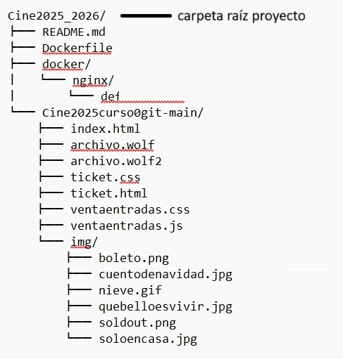

--------------------------------------------------------------------------------------------------------------------

### 2 - Creación de los archivos `default.conf` y `docker-compose.yml`  

#### 🔹 Archivo "default.conf"

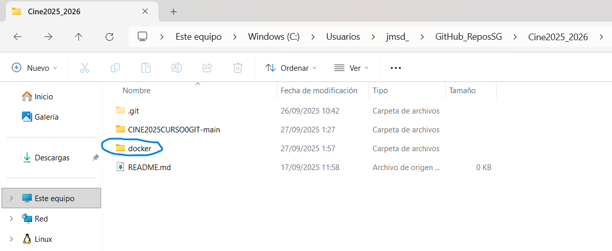

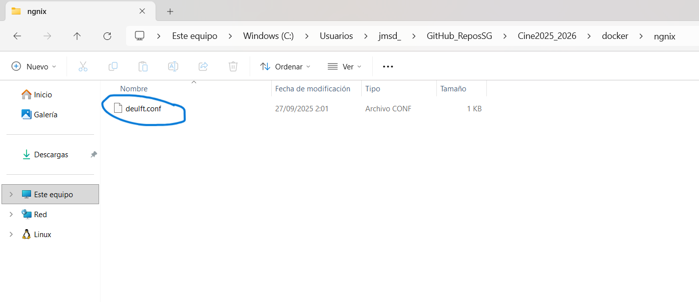

Este archivo se crea en "docker/ngnix/", con el siguiente código ábrelo en el notepad o tu editor de texto favorito):  
```nginx
server {
    listen 80;
    server_name _;

    root /usr/share/nginx/html;
    index index.html index.htm;

    location / {
        try_files $uri $uri/ =404;
    }
}
```nginx

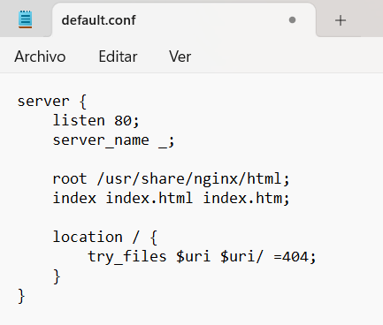

#### 🔹 Archivo "docker-compose.yml" 

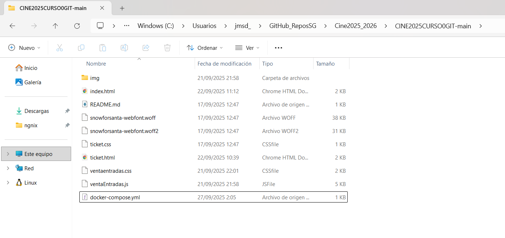

Este archivo se crea en "CINE2025CURSO0GIT-main", con el siguiente código (ábrelo en el notepad o tu editor de texto favorito):  

```yaml
services:
  nginx:
    image: nginx:alpine             # Este campo puede variar si tu imagen ngnix es distinta a esta.
    container_name: cine2025curso0git-main    # Pon aquí el nombre de tu container!
    ports:
      - "8082:80"                   # Si no funciona con "8080:80", probar con "8081:80" u otro.
    volumes:                        # Aquí van los parámetros para los volúmenes del docker, dejarlos tal cuál.
      - ./:/usr/share/nginx/html:ro
      - ./docker/nginx/default.conf:/etc/nginx/conf.d/default.conf:ro
    restart: unless-stopped
```yaml

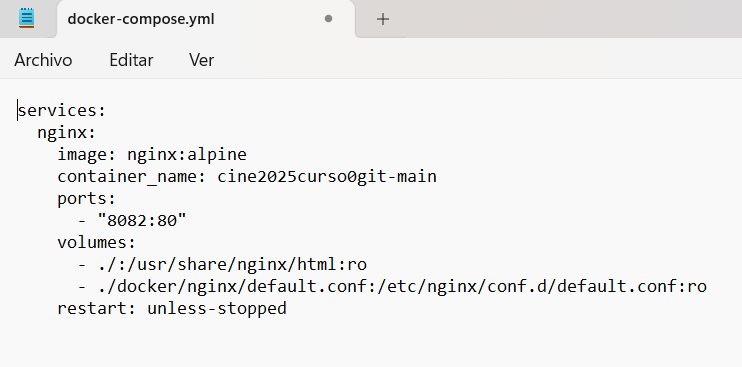

--------------------------------------------------------------------------------------------------------------------

### 3 - CREACIÓN DEL CONTAINER Y LA IMAGEN EN DOCKER.DESKTOP

Para este paso, se va abrir la terminal (cmd, recomendado abrilo como administrador) y se trabajará desde aquí.

- Como paso previo, si estás repitiendo el manual por algún tipo de fallo, antes hay que ejecutar el siguiente comando:

	-> docker compose down

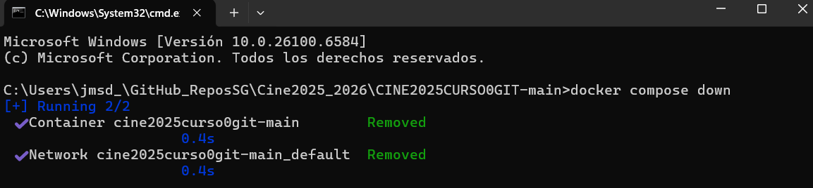 

Con el fin de cerrar y eliminar el contenedor con el mismo nombre del que se va a crear en el siguiente intento. Este paso es solo si hay algún error a la hora de hostear la página web de tu proyecto.

- Lo primero es arrancar el docker.desktop.

- Lo siguiente que hay que hacer, es situarse en el directorio raíz del repositorio.  

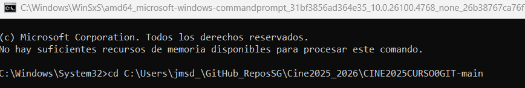* 

- Ahora se usará el comando:

	-> docker compose up -d

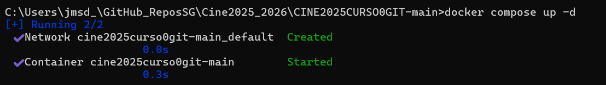* 

Esto descargará la imagen de "nginx:alpine", en caso de no tenerla previamente. Luego, creará y arrancará el contenedor definido en el archivo docker-compose.yml, y desde el docker.desktop verás el container y la imagen creadas como las últimas mostradas en su respectiva columna.

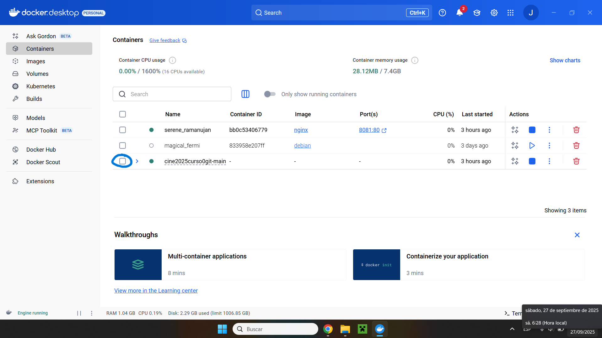
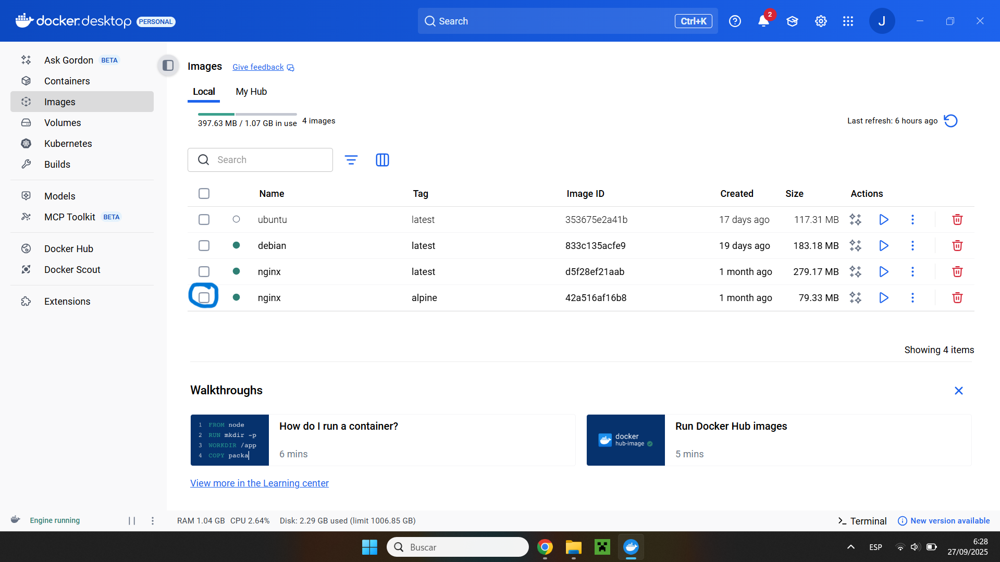

- Ahora se usará el comando:

	-> docker ps

Se realiza con el fin de verificar que el contenedor esté corriendo.

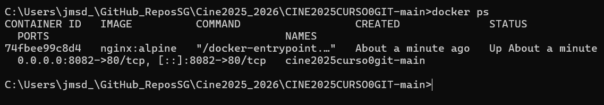

--------------------------------------------------------------------------------------------------------------------

### 4 - Comprobación del hosteo, a través del "http://localhost:8082/", o el puerto que uses.

Utiliza tu navegador preferido para comprobar el hosteo, y escribe en la URl lo siguiente:

	-> http://localhost:8082/

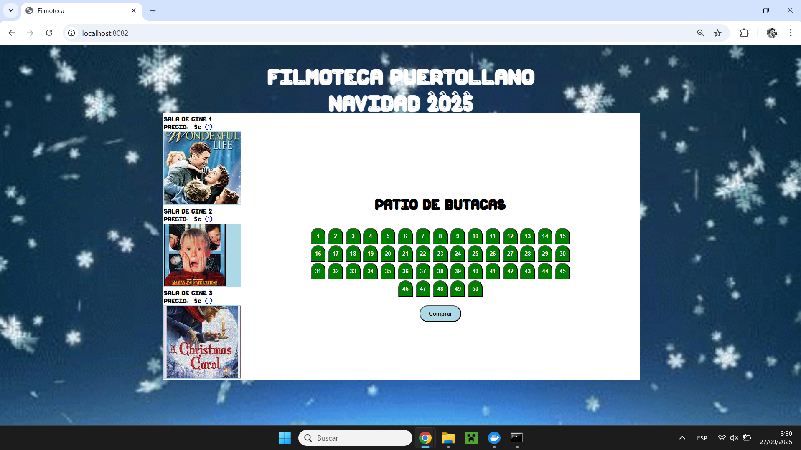

--------------------------------------------------------------------------------------------------------------------

¡Listo!, con esto has sido capaz de comprobar que tu container está corriendo de forma análoga a un servidor tu página web.
